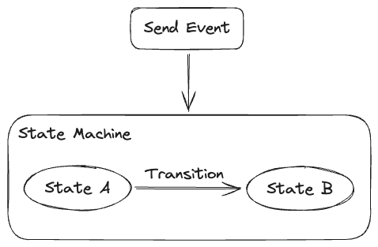

# @deviltea/tiny-state-machine

A simple state machine with a tiny size and type safety.

## Overview

`@deviltea/tiny-state-machine` is a lightweight, type-safe state machine library designed for simplicity and ease of use. It aims to help developers easily manage application states and transitions without adding unnecessary complexity or bloat. This package is ideal for projects that require efficient state management with a minimal footprint.

## Core Concepts

To fully utilize `@deviltea/tiny-state-machine`, it's essential to understand the core concepts that form the foundation of the state machine.

- **State**: A state represents a particular status of the system at a given point in time. In this library, each state is defined with possible transitions and actions.
- **Event**: Events are external or internal triggers that cause the state machine to transition from one state to another. Events are the primary mechanism by which state changes occur.
- **Transition**: A transition is the movement from one state to another, triggered by an event. Each state defines which events it can handle and the target state for those events.

## Features

- **Tiny and Lightweight**: Minimal footprint, optimized for projects where reducing bundle size is important.
- **Type Safety**: Utilizes TypeScript to provide a safe and type-checked state management system.
- **Flexible State Transitions**: Define custom states, events, and transitions to suit your application's needs.
- **Built-in Event Handling**: Attach transition handlers for custom actions during state changes.
- **Support for Final States**: Easily manage terminal states.

## Packages
- [**@deviltea/tiny-state-machine**](./packages/core): The core package that provides the state machine functionality.
- [**@deviltea/tiny-state-machine-vue**](./packages/vue): A simple Vue.js composable function for integrating the state machine with Vue.

## License

[MIT](./LICENSE) License © 2023-PRESENT [DevilTea](https://github.com/DevilTea)
